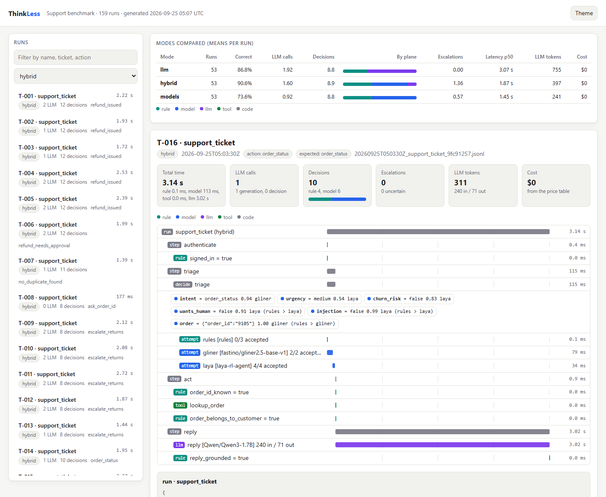

# ThinkLess

**Stop using an LLM for every decision.**

ThinkLess is a decision plane for AI agents. The routine judgments an agent
makes are answered by rules and small calibrated models in milliseconds; the
LLM is kept for the steps that need it and for the decisions the small models
are unsure about. Every step is traced with the plane that handled it, its
confidence, latency, tokens and cost.



## Where to start

- **New here:** [Getting started](getting-started.md) installs ThinkLess and
  walks from a first decision to a traced cascade.
- **Evaluating the idea:** [Benchmarks](benchmarks.md) has the numbers, the
  method, and what the numbers do not show.
- **Comparing decision models:** the [decision benchmark](decision-benchmark/index.md)
  tests intent classifiers, safety checks, raters and extractors on eight
  public tasks, and anyone can submit a model.
- **Building an agent:** [The four planes](concepts/planes.md) explains the
  architecture, and [the support agent](guides/support-agent.md) shows it end
  to end.
- **Going to production:** [Calibration](guides/calibration.md) and the
  [production checklist](guides/production.md).

## In one example

```python
from thinkless import Choice, Engine
from thinkless.llm import TransformersLLM
from thinkless.providers import GLiNER, Laya, LLMDecider, Rules

llm = TransformersLLM("Qwen/Qwen3-1.7B")
engine = Engine([Rules(), GLiNER(), Laya(), LLMDecider(llm)], llm=llm, threshold=0.8)

intent = engine.decide(
    "I was charged twice for order #4471",
    Choice("What does the customer want?", options=["refund", "order_status", "other"], name="intent"),
)
print(intent.value, intent.confidence, intent.provider)   # refund 0.99 gliner
```

The application reads a typed `Decision`. Which provider answered, how
confident it was, and what it cost are in the decision and in the trace.

## Design principles

- **Model-neutral.** Rules, local encoders, hosted System One models and any
  LLM are providers behind one interface. The architecture outlives any single
  model.
- **Measured, not assumed.** Thresholds come from calibration on labeled data;
  benchmarks ship with their result files and can be rerun with one command.
- **Safe by default.** Uncertain decisions never match `is_()`. Consequential
  actions belong behind deterministic checks in code, not behind a model.
- **Observable.** Every decision is a span with its plane, confidence, latency
  and cost, exportable to OpenTelemetry.
- **Small core.** The base install needs `pydantic`, `httpx`, `rich` and
  `typer`. Model libraries are optional extras.
